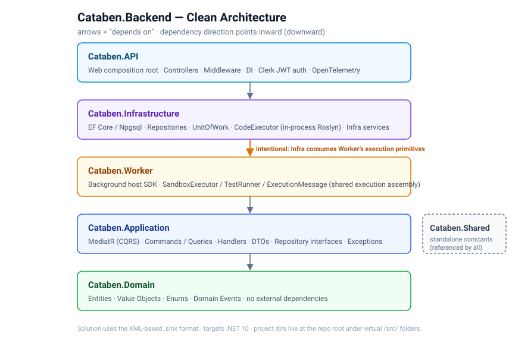

# Cataben.Backend

The backend for **Cataben** — a coding-challenge / learning platform: users solve challenges (incl. SQL challenges with query-plan capture), earn XP/gems, unlock achievements, follow learning paths, and complete daily quests. User-submitted C# is compiled and executed via an in-process Roslyn pipeline.

> **Execution status:** Roslyn compilation is real (`Assembly.Load`), but the sandbox runs **in-process** — there is no true OS-level isolation yet (no AppDomains in .NET; CPU-bound code can't be forcibly killed). The async NATS queue + out-of-process sandbox path exists but is dormant. See [Code execution](#code-execution).



## Tech stack

| | |
|---|---|
| **Runtime** | .NET 10 |
| **Solution** | XML-based `.slnx` |
| **Architecture** | Clean Architecture; dependency direction enforced by project refs |
| **CQRS** | MediatR (commands + queries, handlers in `Application`) |
| **Persistence** | EF Core + Npgsql (Postgres) · `IUnitOfWork` / repositories |
| **Cache / Bus** | Redis (`StackExchange.Redis`) · NATS (dormant async pipeline) |
| **Code execution** | `Microsoft.CodeAnalysis.CSharp` (Roslyn) — in-process |
| **Auth** | Clerk (external IdP) · JWT bearer · `IClaimsTransformation` injects role |
| **Observability** | OpenTelemetry (metrics → Prometheus, traces → OTLP) · Serilog |
| **Rate limiting** | Built-in fixed-window (`Default` 100/min, `Execution` 10/30s) |

## Architecture

Dependency direction points inward — inner layers never depend on outer ones.

```
Cataben.Domain          ← entities, enums, value objects, domain events; no external deps
   ↑
Cataben.Application     ← MediatR (CQRS), DTOs, handlers, exceptions, repository interfaces
   ↑
Cataben.Worker          ← background host + SandboxExecutor / TestRunner / ExecutionMessage
   ↑
Cataben.Infrastructure  ← EF Core (Npgsql), repositories, UnitOfWork, infra services
   ↑                     (references Application + Domain + Worker)
Cataben.API             ← web composition root (references Application + Infrastructure)
Cataben.Shared          ← standalone constants (cache keys, queue names, rate limits)
```

**Non-obvious:** `Infrastructure` references `Worker` (not the reverse) — `Infrastructure/Services/ExecutionWorker.cs` consumes `SandboxExecutor`, `TestRunner`, and `ExecutionMessage`, which live in `Cataben.Worker.Services`. So treat `Worker` partly as a shared execution-primitives assembly, not purely as an outer host.

The `.slnx` groups projects under virtual `/src/` folders, but the project directories live at the repo root.

### The CQRS pattern

Controllers are thin HTTP adapters. **All behavior lives in `Application/Handlers`**, keyed off `Commands/` and `Queries/`. To add a feature: add a `Command`/`Query` + a handler — don't put logic in controllers.

`SubmitChallengeHandler` is the canonical submission flow and the place to learn the **state machine**: `new Submission → MarkAsCompiling → MarkAsExecuting → MarkAsTesting → MarkAsCompleted / Failed / SystemError`, persisting after each transition. `submission.IsSuccess()` (≥80% of total score) = successful → award XP/gems → check achievements → notify. Test cases are scored per-case by weight and compared by whole-stdout equality against each case's `ExpectedOutput`.

### Auth (Clerk)

JWT bearer validates against `Clerk:Issuer` with `MapInboundClaims = false` (keeps `sub` as the Clerk user id). `RoleClaimsTransformation` (`IClaimsTransformation`) injects `ClaimTypes.Role` from the internal `User.Role`, which is what `[CustomAuthorize(UserRole)]` enforces. The internal `User` row is normally created by the Clerk `user.created` webhook at `/api/auth/webhook/clerk`.

## Build & run

```bash
docker compose up -d postgres redis     # backing services only
dotnet run --project Cataben.API         # web API — auto-migrates + seeds on startup
dotnet run --project Cataben.Worker      # background host (currently a heartbeat stub)
```

- `docker-compose.yml` brings up **only Postgres + Redis** (NATS + the OTel collector are optional at dev time).
- **Connection strings**: `appsettings.json` targets container hostnames (`postgres`, `redis`); `appsettings.Development.json` overrides to `localhost`.
- The API applies EF migrations and seeds on startup (`Program.cs` → `MigrateAsync` + `SeedData.InitializeAsync`), wrapped in a 3-attempt retry.
- **Auth**: set `Clerk:Issuer` via **user-secrets** or env var — the value in `appsettings.json` is a placeholder.
  ```bash
  dotnet user-secrets set "Clerk:Issuer" "https://<your-clerk>.clerk.accounts.dev" --project Cataben.API
  ```

### Promoting an admin

The admin dashboard surface (`/api/admin/*`, consumed by the Cataben frontend) requires `UserRole.Admin`. Promote a Clerk user by listing their user id in user-secrets — `SeedData` promotes matching users idempotently on every startup:

```bash
dotnet user-secrets set "Admin:ExternalIds:0" "user_2xxx" --project Cataben.API
```

## Code execution

- `CodeExecutorService` (`Infrastructure`) does real in-process Roslyn compilation → `Assembly.Load`, then delegates the run to `ISandboxManager`.
- `SandboxManager` runs the compiled assembly **in-process**: redirects `Console.Out`/`Error`, invokes the entry point via reflection, races it against a timeout via `Task.WhenAny`. **No true isolation** — a timed-out/rogue task may keep running until it finishes (TODO: out-of-process isolation). The `Sandbox:` config block is not currently used.
- The async pipeline — `ExecutionWorker` subscribing to `code.execute` over NATS, running `SandboxExecutor` + `TestRunner`, scoring, publishing `code.result.{id}` — **exists but is dormant**: `Cataben.Worker`'s `Program.cs` registers only the heartbeat, not `ExecutionWorker`.

## Domain model style

Rich, encapsulated entities — private setters, no public mutation, state changes through intent-revealing methods (`submission.MarkAsCompleted(...)`, `user.AddXp(...)`, `challenge.Publish()`). Child collections exposed as `IReadOnlyCollection`. Value objects in `Domain/ValueObjects`, enums in `Domain/Enums`, domain events in `Domain/Events`.

## Notes

- No test project (no `dotnet test` target).
- `Microsoft.CodeAnalysis.Common` + `CSharp.Workspaces` are pinned to **5.6.0** to keep every Roslyn assembly on one version for `dotnet ef`; the resulting `NU1608` warnings are expected and harmless — do not remove the pin.

---

Frontend: see `cataben.frontend`.
